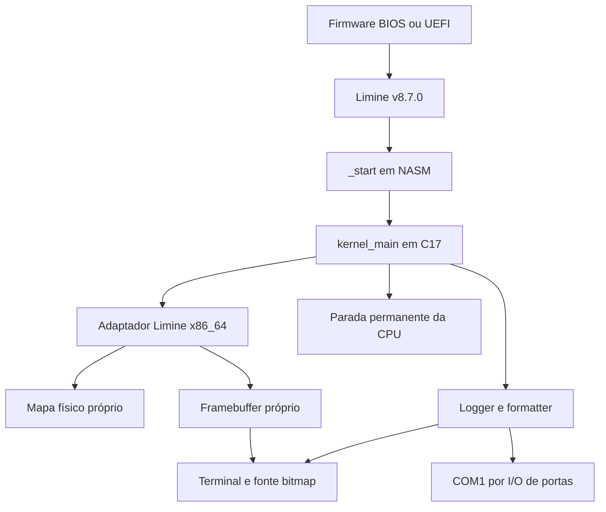

# Arquitetura do UTAMO OS

## Objetivo e fronteiras

O milestone 0.0.1 estabelece um kernel monolítico pequeno para estudo de sistemas
x86_64. As prioridades são correção, clareza dos contratos e diagnóstico.
Módulos separados no fonte não significam isolamento de memória: todo o código
atual executa no ring 0 e compartilha o mesmo espaço virtual.

## Contratos por camada

| Diretório | Responsabilidade | Dependências permitidas |
| --- | --- | --- |
| `kernel/core` | Sequência de boot, log e panic | Interfaces `utamo/` |
| `kernel/arch/x86_64` | ABI de boot, CPU, portas e COM1 | Contratos internos e header Limine apenas em `boot.c` |
| `kernel/drivers/video` | Pixels e terminal | Tipos freestanding; nenhuma estrutura Limine |
| `kernel/memory` | Metadados de regiões físicas | C17 e tipos próprios; nenhum acesso a hardware |
| `kernel/lib` | Memória, strings, formatação | Headers freestanding do compilador |
| `tests` | Harness executável no host | Unidades portáveis; não inclui I/O privilegiado |

`kernel_main` mantém os objetos framebuffer, terminal e mapa em armazenamento
estático com vida útil igual à do kernel. Drivers não descobrem serviços globais
por conta própria. APIs com objetos explícitos permitem novos dispositivos sem
converter todas as funções em singletons.

O logger é uma exceção deliberada: registro estático de até quatro pares
`callback/contexto`. Hoje COM1 e terminal são registrados e recebem os mesmos
caracteres. Arquivo e debug console poderão ser novos sinks; nenhum deles está
implementado. Callbacks não podem chamar o logger recursivamente, bloquear
esperando IRQs ou modificar o registro durante emissão.

## Execução e falhas

Nenhum AP é iniciado. Nenhuma instrução `sti` existe no kernel. Não há alocação,
threads ou locks. O logger não é thread-safe; antes de permitir IRQs/SMP será
necessário definir serialização, buffers por CPU e caminho de panic sem locks.

Retornos `bool` representam falhas recuperáveis da etapa de inicialização.
`kernel_main` decide quando uma falha torna o milestone inviável e chama `PANIC`.
Serial ausente é tolerada; framebuffer ausente, protocolo incompatível e mapa
inválido interrompem o boot. Saídas anteriores à conexão do terminal existem
somente na serial. Não se inventa mensagem de sucesso antes de verificar o retorno.

`kernel_panic` desabilita interrupções, usa strings como dados (`%s`), informa
arquivo/linha e termina em `cpu_halt`. Uma segunda chamada explícita usa uma
mensagem serial simples. Isto não recupera page faults, stack overflow, NMI,
machine checks ou falhas do próprio framebuffer. Não há IDT/IST própria em 0.0.1.

## Freestanding e ABI

O código próprio usa C17, `stdint.h`, `stddef.h`, `stdbool.h`, `stdarg.h` e
`limits.h`. Eles são fornecidos pelo compilador para este ambiente; `stdio.h`,
`stdlib.h` e chamadas ao host pertencem somente aos testes.

O build desabilita PIE, red zone, stack protector sem runtime, unwind automático
e geração de SIMD/FPU. Não há link com libc, CRT ou libgcc. A aritmética atual
usa até 64 bits, suportada diretamente pelo target; operações de 128 bits e novas
extensões exigirão nova inspeção de símbolos. `memmove` foi incluído além da lista
mínima porque o compilador também pode exigir essa primitiva em código
freestanding. [Referência GCC](https://gcc.gnu.org/onlinedocs/gcc/Standards.html).

As extensões GCC `__attribute__` estão restritas às seções/alinhamento/retenção
de requests. O resto da biblioteca não depende de Assembly embutido. Port I/O,
`cli` e `hlt` ficam em NASM com ABI SysV AMD64. Ponteiros de boot são confiados
ao contrato do bootloader após validações estruturais; não existe page walker
para provar que um endereço arbitrário está mapeado.

## Evolução sem implementação prematura

- GDT, TSS, IDT e IST devem preceder o tratamento confiável de exceções e ring 3.
- ACPI fornecerá descoberta de APIC e topologia. PIC/PIT podem ser etapa de diagnóstico;
  temporização e IRQ routing terão interface própria para migração a APIC.
- O PMM administrará frames físicos; VMM administrará mappings e permissões;
  heap usará páginas do VMM. Nenhum deles deve depender de endereço HHDM fixo.
- Scheduler separará estado de thread e processo; SMP exigirá dados por CPU,
  sincronização, TLB shootdown e invariantes de ownership.
- Ring 3 terá espaços virtuais próprios, ELF loader validado e cópias seguras
  entre user/kernel. Syscalls não poderão confiar em ponteiros do chamador.
- VFS separará namespace, handles e operações dos drivers de armazenamento.
  RAM filesystem/initramfs virão antes de FAT32 e escrita em disco.
- PCI/PCIe e DMA precisarão de modelo de dispositivos e de ownership dos buffers.
- Rede terá parsing com comprimentos explícitos, limites por camada e timeouts.
  GUI dependerá de input, memória, processos e uma interface gráfica acima do framebuffer.

Pastas futuras contêm apenas notas de escopo. Não há stubs que retornam sucesso
para funcionalidades inexistentes, ABI de syscall fixada ou drivers fictícios.
