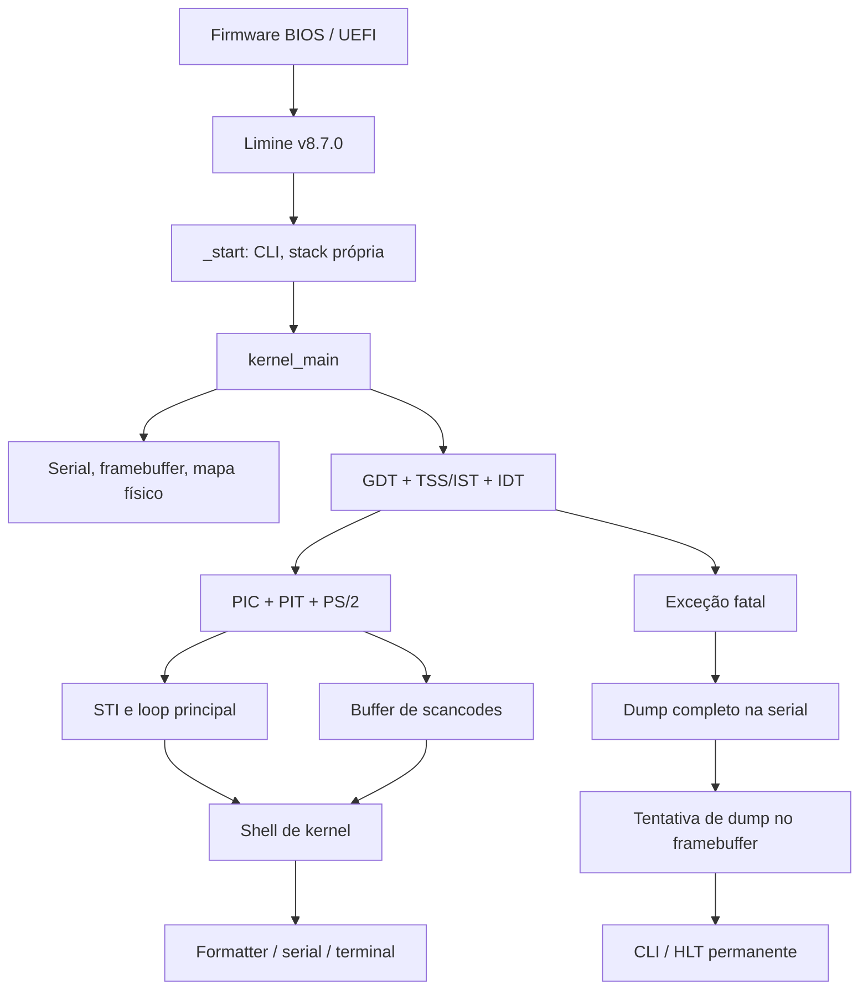

# Arquitetura do UTAMO OS 0.1.0

O kernel monolítico x86_64 evolui o baseline funcional v0.0.1. Limine v8.7.0,
ELF64 higher half, linker, stack bootstrap de 64 KiB, C17 freestanding,
biblioteca, formatter, framebuffer e mapa físico mantêm seus contratos.
A execução continua no BSP, ring 0, sem heap, scheduler, VMM ou userspace.

## Responsabilidades e interfaces

| Diretório | Responsabilidade |
| --- | --- |
| kernel/core | Boot, logger, panic e shell |
| kernel/arch/x86_64 | Adaptador Limine, CPU/portas, COM1, GDT/TSS, IDT, stubs, PIC |
| kernel/interrupts | Dispatch, nomes e diagnóstico de exceções, dispatch de IRQ |
| kernel/drivers/timer | PIT e conversões de tempo |
| kernel/drivers/input | Controlador PS/2 |
| kernel/input | Buffer e decodificação independente do hardware |
| kernel/drivers/video | Pixels, terminal bitmap e fonte existentes |
| kernel/memory | Cópia/validação do memory map, sem alocação |
| kernel/lib | Strings, memória, formatter e parser de linha freestanding |
| tests | Lógica pura e modelos de portas/CPU; nunca instruções privilegiadas |
| scripts | ISO, inspeção ELF e QEMU headless com duração limitada |

Headers internos seguem o padrão existente `kernel/include/utamo/`.
Tipos Limine continuam restritos ao adaptador de boot. O estado de boot e
as tabelas/pilhas têm armazenamento estático; nenhuma memória do bootloader
é liberada. Objetos terminal e memory_map são passados explicitamente à shell.

## GDT e pilhas

| Seletor | Conteúdo |
| --- | --- |
| 0x00 | Null |
| 0x08 | Kernel code, present, DPL0, L=1, D=0 |
| 0x10 | Kernel data, present, DPL0, L=0 |
| 0x18 / 0x20 | Reservados, não presentes, para futuro user mode |
| 0x28 / 0x30 | Descritor TSS de 16 bytes |

A GDT possui 56 bytes; GDTR.limit=55. A CPU atualiza bits accessed/busy,
portanto ela é gravável. A TSS64 tem 104 bytes, limite103 e iomap_base104
(sem bitmap de permissões de I/O). RSP0 permanece sem uso, pois não há ring3.
Três stacks estáticas de16 KiB, alinhadas16, alimentam IST1 Double Fault,
IST2 NMI e IST3 Machine Check. Não há guard pages nesta versão.

`lgdt`, retorno far para recarregar CS, atualização de DS/ES/SS/FS/GS e
`ltr` ficam em NASM. Não há `swapgs`, TLS ou troca de privilégio.

## Interrupções e concorrência

A IDT tem256 gates de16 bytes, tipo0x8e (interrupt gate DPL0), CS0x08.
Vetores0–31 são exceções,32–47 são IRQs PIC,48–255 têm tratamento fatal seguro.
Detalhes do frame176 bytes, códigos de erro e tabela relativa dos stubs em
[interrupts.md](interrupts.md).

A ordem obrigatória é GDT → IDT → PIC mascarado → PIT/PS2 → desmascarar
somente drivers prontos → STI. IRQs entram com IF0, salvam15 GPRs, limpam DF,
alinham RSP antes de CALL e retornam com IRETQ. Flags do contexto são restauradas.

O PIC8259 usa0x20/0x28; IRQ0→32 e IRQ1→33. Apenas essas linhas são abertas.
O slave permanece mascarado. IRQ7/15 espúrias consultam ISR: IRQ7 espúria não
recebe EOI; IRQ15 espúria reconhece apenas o cascade do master. IRQs reais
recebem EOI no slave quando aplicável, seguido do master. Fontes sem driver
são mascaradas. Futuro APIC/IOAPIC terá descoberta ACPI, mantendo essa camada
de IRQ como fronteira; não há APIC implementado.

PIT canal0, modo2, comando0x34, divisor11932, clock nominal1193182 Hz:
aproximadamente99,99849 Hz, alvo100 Hz. IRQ0 apenas incrementa contador uint64
monotônico saturante. Uptime usa conversão nominal100 Hz; não é relógio civil,
não é calibrado e pode perder ticks se IF ficar desabilitado por muito tempo.

IRQs não chamam o logger, terminal ou shell. O logger tem sinks fixos após
bootstrap e é usado somente pelo fluxo principal; interrupções podem ocorrer
durante output porque drivers não acessam esses sinks. Exceções não retornam:
usam saída emergencial própria, primeiro serial, depois terminal, com guarda
de recursão. Nenhum lock bloqueante é usado.

Acesso principal ao buffer de input e snapshots de ticks usam save/CLI/restore
de IF. Chamadas NASM externas formam a fronteira do compilador; o build não usa
LTO. Volatile expõe o contador assíncrono; exclusão de IRQ define ownership,
sem alegar que volatile por si só fornece sincronização. Isso não é contrato SMP.

O loop processa input fora da ISR, desabilita IF, verifica novamente trabalho,
e usa `sti; hlt` contíguos quando vazio. A sombra de STI evita a janela de
perda de wakeup. HLT operacional retorna quando chega IRQ; `cpu_halt` mantém
IF0 e nunca retorna.

## Input e shell

[Teclado e shell](keyboard.md) descreve protocolo, buffer, line editor, limites
e comandos. Trata-se de shell integrada ao kernel, sem processos, pipes,
filesystem ou execução de programas externos. `mem` relata metadados reais
do boot, não páginas livres de um allocator.

## Evidência e próximos passos

A matriz efetivamente executada e suas limitações ficam em
[v0.1-implementation-report.md](v0.1-implementation-report.md).
QEMU automatizado é sempre headless e sequencial. Input PS/2 em execução e
inspeção visual permanecem pendentes de validação manual por solicitação do usuário.
A evolução seguinte deve estabelecer PMM/VMM, reservas, page tables próprias
e guard pages; ACPI/APIC é uma etapa independente antes de SMP.
