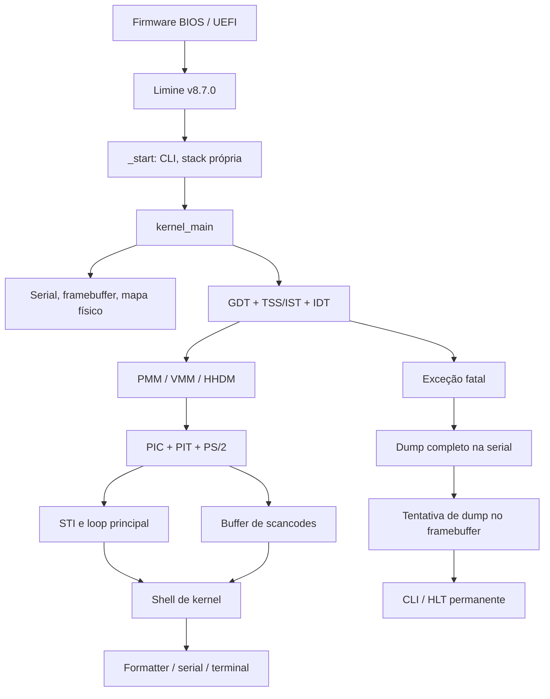

# Arquitetura do UTAMO OS v0.2

O kernel monolítico x86_64 evolui o baseline funcional v0.1.0, preservando v0.0.1. Limine v8.7.0,
ELF64 higher half, linker, stack bootstrap de 64 KiB, C17 freestanding,
biblioteca, formatter, framebuffer e mapa físico mantêm seus contratos.
A execução continua no BSP, ring 0, com PMM/VMM próprios e sem heap, scheduler ou userspace.

## Responsabilidades e interfaces

| Diretório | Responsabilidade |
| --- | --- |
| kernel/core | Boot, logger, panic e shell |
| kernel/arch/x86_64 | Adaptador Limine, CPU/portas, COM1, GDT/TSS, IDT, stubs, PIC |
| kernel/interrupts | Dispatch, nomes e diagnóstico de exceções, dispatch de IRQ |
| kernel/drivers/timer | PIT e conversões de tempo |
| kernel/drivers/input | Controlador PS/2 |
| kernel/input | Buffer e decodificação independente do hardware |
| kernel/drivers/video | Pixels, terminal bitmap e fonte existentes |
| kernel/memory | Mapa físico, HHDM, PMM/VMM, reservas e selftests |
| kernel/lib | Strings, memória, formatter e parser de linha freestanding |
| tests | Lógica pura e modelos de portas/CPU; nunca instruções privilegiadas |
| scripts | ISO, inspeção ELF e QEMU headless com duração limitada |

Headers internos seguem o padrão existente `kernel/include/utamo/`.
Tipos Limine continuam restritos ao adaptador de boot. O estado de boot e
as pilhas e descritores têm armazenamento estático; novas page tables
são frames PMM fixados. Nenhuma memória do bootloader é liberada. Objetos terminal e memory_map são passados explicitamente à shell.

## Memória física e virtual

O PMM usa dois bitmaps dinâmicos para frames de 4 KiB. Somente USABLE
é elegível; página zero, metadados e reservas não são liberáveis.
Alocação contígua usa next-fit, e free/reserve validam ranges completos
antes de modificar qualquer bit. Frames publicados como tabelas são fixados.

O VMM conserva CR3 e valida todas as tabelas herdadas antes de escrever
os bitmaps, exigindo seus frames em BOOTLOADER_RECLAIMABLE.
HHDM é convertido pela camada pura hhdm.c e conferido contra as traduções
reais. Bootloader/ACPI não são recuperados.

Queries aceitam endereços canônicos e folhas de 4 KiB/2 MiB/1 GiB.
Mutações públicas só alcançam páginas de 4 KiB na arena do slot PML4 384,
sobre frames USABLE alocados. Ramos novos são zerados fora da árvore,
publicados integralmente e fixados; falhas devolvem os frames temporários.
Unmap não libera dados. Tabelas intermediárias vazias permanecem retidas.

MAXPHYADDR vem de CPUID; LA57 é rejeitado, NX depende de CPUID/EFER e
CR0.WP é habilitado. Proteções RX/RO-NX/RW-NX se aplicam ao mapping
principal quando compatível; aliases HHDM podem continuar graváveis e
executáveis. Não há W^X global, guard pages ou TLB shootdown.

[Gerenciamento de memória](memory-management.md) especifica reservas,
ownership, concorrência, permissões e selftests.
[Layout](memory-layout.md) registra endereços e limites.

## GDT e pilhas

| Seletor | Conteúdo |
| --- | --- |
| 0x00 | Null |
| 0x08 | Kernel code, present, DPL0, L=1, D=0 |
| 0x10 | Kernel data, present, DPL0, L=0 |
| 0x18 / 0x20 | Reservados, não presentes, para futuro user mode |
| 0x28 / 0x30 | Descritor TSS de 16 bytes |

A GDT possui 56 bytes; GDTR.limit=55. A CPU atualiza bits accessed/busy,
portanto ela é gravável. A TSS64 tem 104 bytes, limite 103 e iomap_base 104
(sem bitmap de permissões de I/O). RSP0 permanece sem uso, pois não há ring 3.
Três stacks estáticas de 16 KiB, alinhadas a 16 bytes, alimentam IST1 Double Fault,
IST2 NMI e IST3 Machine Check. Não há guard pages nesta versão.

`lgdt`, retorno far para recarregar CS, atualização de DS/ES/SS/FS/GS e
`ltr` ficam em NASM. Não há `swapgs`, TLS ou troca de privilégio.

## Interrupções e concorrência

A IDT tem 256 gates de 16 bytes, tipo 0x8e (interrupt gate DPL0), CS 0x08.
Vetores 0–31 são exceções, 32–47 são IRQs PIC, 48–255 têm tratamento fatal seguro.
Detalhes do frame de 176 bytes, códigos de erro e tabela relativa dos stubs em
[interrupts.md](interrupts.md).

A ordem obrigatória é GDT → IDT → PMM/VMM → PIC mascarado → PIT/PS2 → desmascarar
somente drivers prontos → STI. IRQs entram com IF=0, salvam 15 GPRs, limpam DF,
alinham RSP antes de CALL e retornam com IRETQ. Flags do contexto são restauradas.

O PIC 8259 usa offsets 0x20/0x28; IRQ0 → 32 e IRQ1 → 33. Apenas essas linhas são abertas.
O slave permanece mascarado. IRQ7/15 espúrias consultam ISR: IRQ7 espúria não
recebe EOI; IRQ15 espúria reconhece apenas o cascade do master. IRQs reais
recebem EOI no slave quando aplicável, seguido do master. Fontes sem driver
são mascaradas. Futuro APIC/IOAPIC terá descoberta ACPI, mantendo essa camada
de IRQ como fronteira; não há APIC implementado.

PIT canal 0, modo 2, comando 0x34, divisor 11932, clock nominal 1193182 Hz:
aproximadamente 99,99849 Hz, alvo 100 Hz. IRQ0 apenas incrementa contador uint64
monotônico saturante. Uptime usa conversão nominal de 100 Hz; não é relógio civil,
não é calibrado e pode perder ticks se IF ficar desabilitado por muito tempo.

IRQs não chamam logger, terminal ou shell e não alocam frames nem alteram page tables. O logger tem sinks fixos após
bootstrap e é usado somente pelo fluxo principal; interrupções podem ocorrer
durante output porque drivers não acessam esses sinks. Exceções não retornam:
usam saída emergencial própria, primeiro serial, depois terminal, com guarda
de recursão. Nenhum lock bloqueante é usado.

Acesso principal ao buffer de input e snapshots de ticks usam save/CLI/restore
de IF. Chamadas NASM externas formam a fronteira do compilador; o build não usa
LTO. Volatile expõe o contador assíncrono; exclusão de IRQ define ownership,
sem alegar que volatile por si só fornece sincronização. Isso não é contrato SMP.

O loop processa input fora da ISR, desabilita IF, verifica novamente trabalho,
e usa `sti; hlt` contíguos quando vazio. A sombra de STI evita a janela de
perda de wakeup. HLT operacional retorna quando chega IRQ; `cpu_halt` mantém
IF=0 e nunca retorna.

## Input e shell

[Teclado e shell](keyboard.md) descreve protocolo, buffer, line editor, limites
e comandos. Trata-se de shell integrada ao kernel, sem processos, pipes,
filesystem ou execução de programas externos. `mem` reúne mapa de boot e
estatísticas PMM/VMM; os comandos de memória estão em
[memory-management.md](memory-management.md).

## Evidência e próximos passos

As [notas da release v0.1](releases/v0.1.0.md) e seu
[relatório](v0.1-implementation-report.md) permanecem históricos.
Eles não substituem validação da imagem v0.2.

A automação atual acrescenta testes de memória por PS/2 emulado/QMP e serial,
sempre headless, sequencial e com timeout. O [development log](development-log.md)
registra a validação final de 14.213 checks sem falhas, identificada no
[relatório v0.2](v0.2-implementation-report.md). Teclado físico, aparência gráfica, UEFI e hardware real
são categorias separadas de evidência.

O próximo milestone é v0.3, kernel heap. Reclaim, aliases HHDM, guard pages,
address spaces por processo e SMP exigem contratos adicionais.
ACPI/APIC continua uma frente separada.
